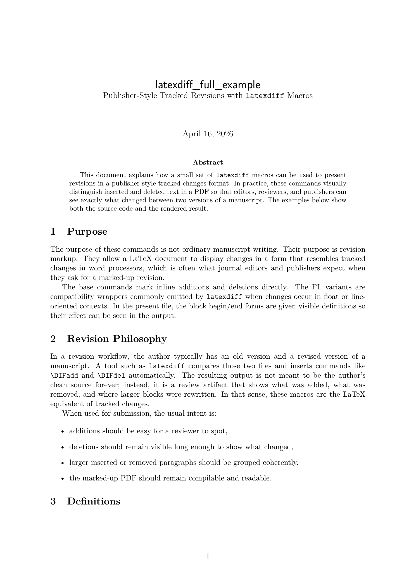
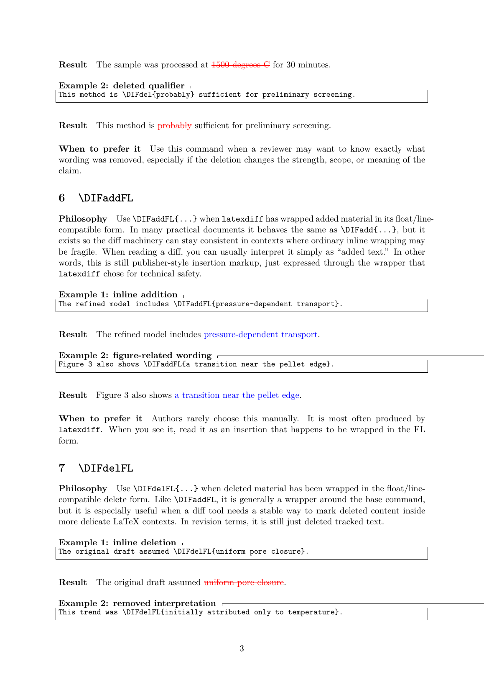
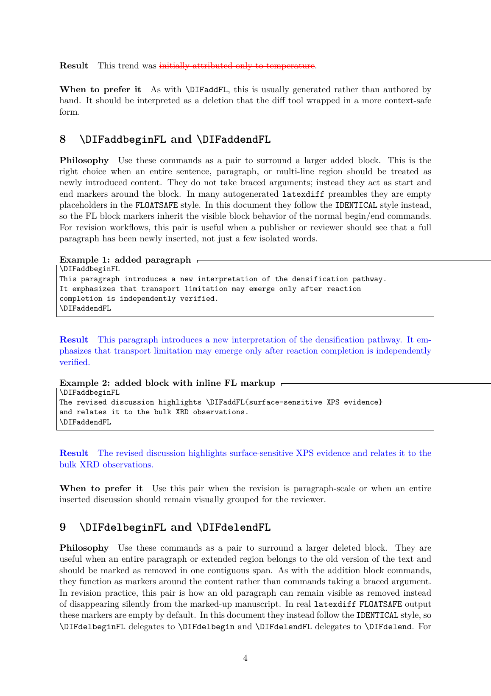

# Track Changes in LaTeX — VS Code Extension

I just published a new VS Code extension: **[Track Changes in LaTeX — VS Code Extension](https://marketplace.visualstudio.com/items?itemName=MShirazAhmad.track-changes-in-latex-vscode)**. It lets you visualize how your LaTeX documents evolve by building diffs straight from the git commit history.

## What it does
- Shows a commit-by-commit view of your LaTeX files so you can track changes visually.
- Generates diffs using your repository history, making it easy to review edits before merging or sharing PDFs.
- Runs directly inside VS Code—no separate scripts or manual commands needed once configured.

## Why I built it
Keeping track of LaTeX edits across branches can be tedious. This extension keeps everything inside VS Code, so you can stay focused on writing while still having a clear audit trail of how a document changes over time.

## Try it out
Clone the repository and install the extension locally to give it a spin:

```bash
git clone https://github.com/MShirazAhmad/Track-Changes-in-LaTeX-VSCode.git
cd Track-Changes-in-LaTeX-VSCode
npm install
npm run compile
npx @vscode/vsce package
```

Then load the extension into VS Code from the generated package (**Extensions** → `...` → **Install from VSIX**) and start diffing your LaTeX files against any commit in the timeline. Feedback and contributions are welcome.

## Quick Setup from VS Code Marketplace

If you usually install extensions by searching in VS Code:

1. Open **Extensions** (`Ctrl+Shift+X` / `Cmd+Shift+X`).
2. Search: `Track Changes in LaTeX — VS Code Extension`.
3. Open the extension page and click **Install**.


*Marketplace view: find the extension in search and install it directly from VS Code.*

## How to use it
- Open your LaTeX project in VS Code, and right-click a `.tex` file in **Source Control** (Changes/History) or **Explorer**.
- Select **Track Changes in LaTeX**, choose the OLD version, then pick the NEW version (a commit or your working directory).
- The extension writes a `diff_<old>_to_<new>_<file>.tex` file next to your source file and offers to open it.
- Compile that diff file (`pdflatex diff_...tex`) to produce a PDF with tracked changes: additions in blue, deletions in red.
- If you want the PDF to mirror your journal template, compile with the same main document preamble (e.g., `pdflatex -jobname=tracked-change "\input{diff_...tex}"`) so fonts and spacing match.

## In-editor selection flow (screenshots)


*Right-click any `.tex` file in Explorer or Source Control to start the diff workflow without leaving VS Code.*


*Anchor the older side of the diff by selecting the commit you want to compare against.*


*Pick the newer side of the comparison—usually your working directory—to see the latest edits against an earlier commit.*


*This is the compiled PDF produced from the generated `latexdiff` file, showing additions in blue and deletions in red just as journals require.*

## Share or submit with tracked changes
- **Send to collaborators or advisors:** Compile the generated diff file to PDF and share it so reviewers can see all edits in color. The PDF is fully standalone for quick comment rounds.
- **Submit to publishers with change markup:** When responding to reviewer comments, generate a diff between the last published commit and your revised draft. The resulting PDF clearly marks insertions/deletions, so you can upload it as the tracked changes version many journals request.
- **Pre-merge validation:** Before merging a branch, create a diff versus `main` to verify all manuscript edits are intentional. This also produces a ready-to-circulate tracked-changes PDF for sign-off.
- **Advisory revisions with context:** Pair the diff PDF with your advisor’s comment IDs by generating diffs on specific branches (e.g., `advisor-notes` → `revision-v2`). Each colored change maps directly to a comment, speeding up approval.
- **Camera-ready confidence:** Before final submission, regenerate the diff against the camera-ready branch to ensure no late-stage formatting tweaks slipped in unnoticed.

## Read the Docs
For docs rendering on Read the Docs, the screenshots are referenced from the docs tree using `_static/images/...` paths in `/docs/usage.md`.

## License
MIT — see [LICENSE](LICENSE) for details.
