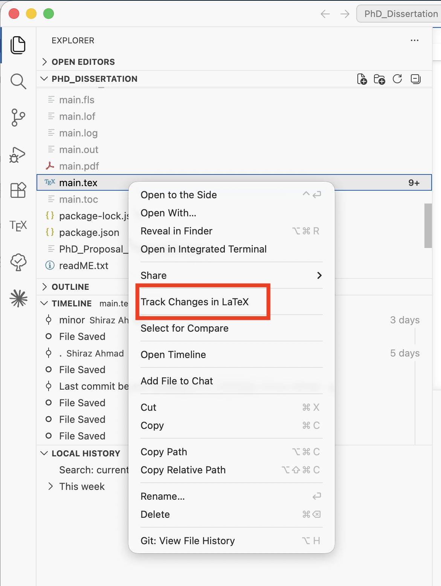
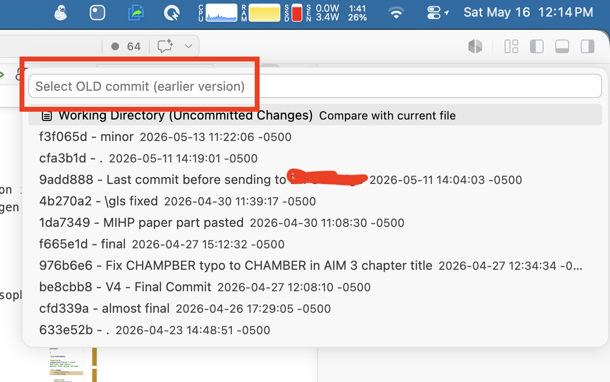
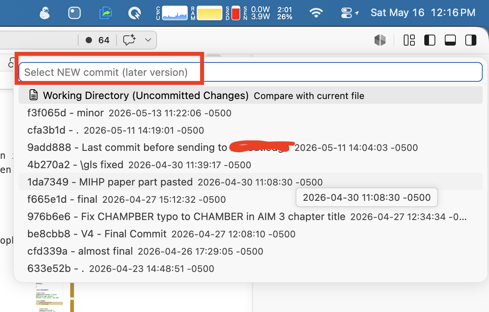
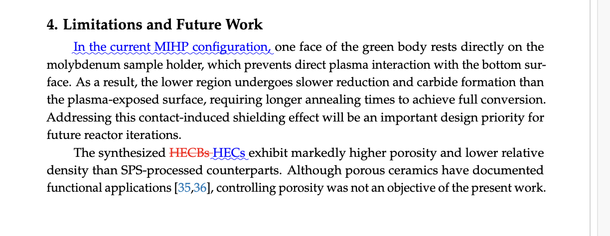

# Track Changes in LaTeX — VS Code Extension

The publication workflow for a research paper usually follows a familiar path.

First, you submit your manuscript to a journal. After editorial screening and peer review, you receive referee comments. You then revise the manuscript, address the reviewers’ questions, and prepare the revised submission package.

In many cases, journals require two manuscript files at the revision stage:

1. A clean revised PDF
2. A revised PDF with tracked changes

This second file is especially important because it allows editors and reviewers to see exactly what has changed since the original submission.

For researchers using LaTeX, preparing a tracked-changes version can become inconvenient, especially when the project has grown large with multiple sections, figures, tables, bibliography files, and supplementary material. Online LaTeX compilers are useful, but they can become expensive as project size and collaboration needs increase.

Recently, I moved my LaTeX writing workflow to Visual Studio Code. With LaTeX compilation extensions and built-in Git support, VS Code provides a powerful local environment. The project files remain on my own machine, compilation happens locally, and Git makes it easy to track every important version of the manuscript.

This experience led me to build a VS Code extension for generating tracked-changes PDFs from Git history.

The workflow is simple:

Before submitting the manuscript to a journal, commit the LaTeX project and label that commit clearly, for example:

“Submitted for Publication”

After receiving reviewer comments, revise the manuscript as usual. Once the revision is complete, commit the revised version and label it, for example:

“Revision 1”

The extension then allows you to select these two Git commits and automatically generate a LaTeX diff. This produces a PDF showing the tracked changes between the submitted version and the revised version.

This makes the revision process much smoother. Instead of manually tracking edits or struggling to prepare a marked-up manuscript, you can use the Git history that already exists in your project.

The goal is straightforward: help researchers prepare clean, revised files and tracked-changes files with less hassle, while keeping the full LaTeX workflow local, transparent, and reproducible.

For anyone writing papers in LaTeX and handling journal revisions, this can make the submission and resubmission process more organized and less stressful.

## Usage Guidelines

Follow these visual steps to generate tracked-changes for a `.tex` file.

1) Right-click the `.tex` file and choose the command:

2) Select the older commit you want to compare against:

3) Select the newer commit (or working directory) you want to compare to:

4) Compile the generated `.tex` file to produce the tracked-changes PDF:

Guidance:

- Right-click the target `.tex` file from Explorer or Source Control (Timeline/Changes).
- When choosing commits, prefer labeled submission/revision commits (for example, `Submitted for Publication` and `Revision 1`).
- If you select the working directory as the newer side, ensure you saved the latest changes before generating the diff.
- Compile the produced `diff_<old>_to_<new>_<file>.tex` with the same LaTeX engine and preamble you normally use (`pdflatex`, `xelatex`, or `lualatex`) so fonts and spacing match the journal template.

## License

MIT — see [LICENSE](https://github.com/MShirazAhmad/Track-Changes-in-LaTeX-VSCode/blob/main/LICENSE) for details.
